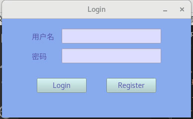
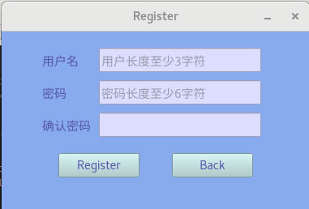
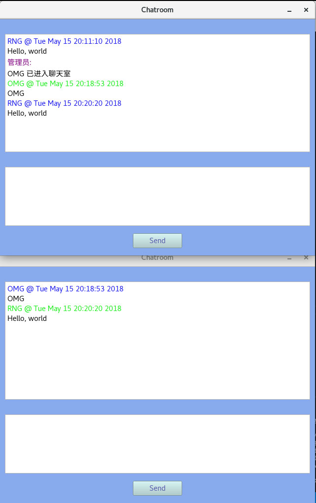
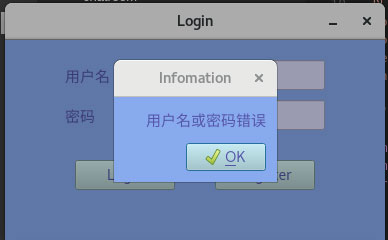
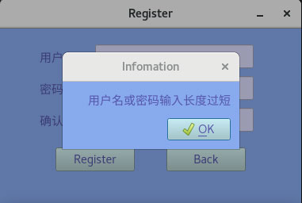

# PyQt5 chatroom Readme

third-party dependence packages: **PyQt5**, **pymysql**

第三方依赖: **PyQt5**, **pymysql**

## 目录

- [class Login(QMainWindow)](#login)
- [class Register(QMainWindow)](#register)
- [class Chatroom(QMainWindow)](#chatroom)
- [class Popup(QMessageBox)](#popup)
- [class CliSoc(QUdpSocket)](#clisoc)

## Login

## Register

## Chatroom

## Popup

## CliSoc

是一个基于 UDP 的套接字类, 负责连接服务器
